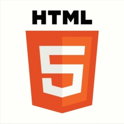

---
# Feel free to add content and custom Front Matter to this file.
# To modify the layout, see https://jekyllrb.com/docs/themes/#overriding-theme-defaults

layout: null
---
<html lang="en">
<head>
    <meta charset="UTF-8" />
    <meta name="viewport" content="width=device-width, initial-scale=1.0, maximum-scale=1.0" />
    <title>Title</title>
    <link rel="stylesheet" href="css/style.css" />
    <link href="https://fonts.googleapis.com/css?family=Karla" rel="stylesheet" />

    
    
</head>
<body>

    

        <a href="" onclick="pageHeightChecker('bio')"><h2>Bio</h2></a>
        <a href="" onclick="pageHeightChecker('skills')"><h2>Kompetencer</h2></a>
        <a href="" onclick="pageHeightChecker('projects')"><h2>Projekter</h2></a>
        <a href="" onclick="pageHeightChecker('contact')"><h2>Kontakt</h2></a>

    

    

        <h1 class="headline">Victor Adam Ott Frank </h1>
        <h2 class="headline">Object Oriented Development   and Web</h2>

    

    

        

            <h2 class="headline">Hvem er jeg?</h2>

            
Release Early - Release Often
             
             
            

            

             
            <!-- -->
            

               Jeg er 24 år, læser en erhvervsakademisk uddannelse som datamatiker og bor I Ølstykke med min kæreste. Jeg er analytisk skarp, nysgerrig og bestemt ikke bange for en udfordring. Derudover er jeg imødekommende og altid mødestabil. 
  
Når jeg har fuldført min nuværende uddannelse i 2019, har jeg planer om at specialisere mig videre til bachelor niveau i IT-sikkerhed,  da det er her, min interesse især ligger.
            

        

    

    

        <h3 class="headline">FACTS</h3>
        

            Victor Adam Ott Frank  
            24 år  
            Datamatiker AK 
        

    

    

        <h3 class="headline">Erfaring</h3>

        <ul class="experience elist">
            <li id="job1"><h5 id="job1H">1.Assistent</h5>
            

                
 1. Assistent | Sep 2014 -  | v. Netto 
                    Nøglebærer, primært lukkevagter. Overblik, struktur i arbejdsgangene og lokal ledelse af aftenhold.
                     
                

            

            </li>

            <li id="job2"><h5 id="job2H">Lageransvarlig</h5>
            

                
 Lageransvarlig | 2015 | v. Aldo 
                    Lageransvarlig v. Aldo i Rødovre. Optælling, opsætning og kontrol af varer.
                

            

            </li>

            <li id="job3"><h5 id="job3H">IT-Assistent</h5>
            

                

                IT-Assistent | Feb. 2017 -  | Bent Anthony ApS. 
                Ad-hoc opgaver, samt opsætning af Mobilepay Buisness.

                

            

            </li>
            <li id="job4"> <h5 id="job4H">Java Udvikler</h5>
                

                    

                    Java Udvikler | April 2018 | Mogens Nørgaard Trade  
                    Udviklet en Java Spring MVC applikation, en oversigt over restordrer, med tilhørende GUI og en lokal database server.
                    

                

            </li>
        </ul>

             
             

         
         
    

    

        

            <h1 class="headline">Foretrukne Sprog</h1>
            

                <!--Overordnet Development-->
                
Jeg er specialiseret i <a>objektorienteret programmering og design</a> og jeg arbejder enten <a>Agile eller Iterativt </a> afhængig af opgaven. 
                    Mine design tager udgangspunkt i den <a> individuelle kunde</a>, deres behov og deres kunder.
                      
                    <!--Partikulære sprog-->
                    I kraft af min uddannelse arbejder jeg med OOD, men det føles også intuitivt for mig som en sprogligt anlagt person. 
                    I forbindelse med min uddannelse har jeg erfaring med <a>Java</a> som backend technology, men jeg har også undersøgt Javas
                    front end technology alternativer som: <a>Java Swing, JavaFX, Java Spring og Japplet</a>.
                      
                    På datasiden af applikationen har jeg erfaring med <a>MySQL</a>, både OO og dokumentbaseret vha. <a>X-Plugin</a>. 
                    Desuden er jeg stærk i de objektorienterede sprog <a>HTML, JavaSript og CSS</a>.
                      
                    <!--Overordnet Design-->

                     
                

            

            

    

    

    

    
            

            

        

    

        <h1 class="headline">Anden Erfaring</h1>

        

        
        
        

        

    

    

    

        

            <h1 class="headline" id="projectsH1">Projects &darr;</h1>
            <h1 class="projectHeadline">Project 1</h1>
            
            

                 
                

                    
Mit første erhvervsprojekt har jeg udviklet i samarbejde med <a href="http://www.mn-trade.dk/">MN-trade</a> som havde brug for et nyt system til at holde styr på sine restordrer.
                          Til udviklingen gjorde jeg brug af en evolutionær/iterativt UP tilgang og under modelleringsfasen brugte jeg Unified  Modeling Language <a href="#">(UML)</a>.
                          Selve applikationen er skrevet i Java Spring og efterfølgende hosted hos <a> Amazon Web Services </a>, ved hjælp af Amazon Elastic Beanstalk, Amazon Relational Database (som kører MySQL) og tilhørende Firewall.
                    

                

            

            <h1 class="projectHeadline">Project 2</h1>
            

            

                 
                

                    
Dette projekt har jeg udviklet efter, at have besøgt mange forskellige sider for opskrifter og brugt apps som Pinterest. Til fælles har disse sider og applikationer at de alle bruger enkle keywords og tags til at beskrive opskrifterne. 
                        Derfor udviklede jeg denne <a>application med tilhørende hjemmeside og database</a>, hvilket gøre det muligt at søge i kategorier som er langt bredere end enkle keywords.
                          Dette var med henblik på at gøre det nemmere og mere overskueligt at søge i forskellige køkkener, samt se forberedelsestid og vælge sin primære ingrediens (alt fra gris til vegetarisk).
                          Selve applikationen er skrevet i <a>Java Spring</a> og efterfølgende hosted hos <a>Amazon Web Services</a>, ved hjælp af <a>Amazon Elastic Beanstalk, Amazon Relational Database</a> (som kører MySQL) og tilhørende Firewall.
                    

                

            

        

    

    

        <h3>Victor Adam Ott Frank </h3><h3>VictorOttFrank@yahoo.com </h3><h3>+45 25305919 </h3>
    

</body>
</html>
