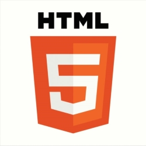
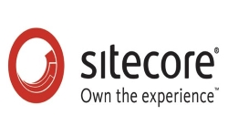

---
# Feel free to add content and custom Front Matter to this file.
# To modify the layout, see https://jekyllrb.com/docs/themes/#overriding-theme-defaults

layout: null
---
	<!DOCTYPE html>
<html lang="en">
<head>
    <meta charset="UTF-8">
    <meta name="viewport" content="width=device-width, initial-scale=1.0">
    <title>Main</title>
    <link rel="stylesheet" href="css/Main.css" type="text/css">
    <link rel="script" href="jquery-3.3.1.min.js">
    <link rel="script" href="js/main.js">
</head>
<body>

    

    

        
        

            <h1 class="headline">Victor Adam Ott Frank</h1>
            
Jeg er 24 år, læser en erhvervsakademisk uddannelse som datamatiker og bor I Ølstykke med min kæreste.

                På min uddannelse har jeg specialiseret mig i desktop applikationer, dvs. servlets og web baserede applets.  Fagligt er jeg stærkest i objektorienteret programmering og databaser - både relationelle og dokumentbaserede løsninger.  Jeg har mest erfaring med alsidige, objektorienterede sprog som Java, SQL, HTML, men undervejs har jeg også arbejdet med NoSQL og CSS.

            
 

                 Mine studiejobs har ikke tidligere været studierelevante, men gennem flere år som 1. assistent i Netto har jeg lært at bibeholde det store overblik og arbejde som den ansvarlige i et team af flere mennesker.   Og det er altid mig, der bliver kaldt på, når nogen i familien har problemer med deres teknologi - uanset om det er computere, iPhones eller overvågning i svigerfamiliens firma 😊.

                 Derudover har jeg studeret dansk to år på Københavns Universitet, og selvom min kærlighed for sprog ikke er forsvundet, så har jeg valgt at skifte fag. Det har det givet mig brugbar viden om professionelle genrer og kommunikationsanalyse og det har givet mig erfaring med tekstproduktion.
                

 

                 Personligt er jeg analytisk skarp, nysgerrig og bestemt ikke bange for en udfordring. Derudover er jeg imødekommende og altid mødestabil Når jeg har fuldført min nuværende uddannelse i 2019, har jeg planer om at specialisere mig videre til bachelor niveau i IT-sikkerhed,  da det er her, min interesse især ligger.       

        

    

    

        

            <h3 class="headline">Bio</h3>
            

                Navn: Victor Adam Ott Frank  
                Alder: 24  
                Nuværende Uddannelse: Datamatiker AK  
                Fra: Hovedstadsområdet 
            

        

        

            <h3 class="headline">Erfaring</h3>
            
 1. Assistent | Sep 2014 -  | v. Netto
                Nøglebærer, primært lukkevagter. Overblik, struktur i arbejdsgangene og lokal ledelse af aftenhold.
             Lageransvarlig | 2015 | v. Aldo
                Lageransvarlig v. Aldo i Rødovre. Optælling, opsætning og kontrol af varer.
            

             IT-medhjælper | Feb. 2017 -  | Spunk Bar ApS.
                Ad-hoc opgaver, samt opsætning af Mobilepay Buisness.
                
             Freelance | April 2018 | Morten Nørgaard Trade  Udviklet en Java Spring MVC applikation, en oversigt over restordrer, med tilhørende GUI og en lokal database server.

        

    

    

        <h1 class="headlineL">Objekt Orienteret Programmering</h1>
        
        

            <h3 class="headline">Java</h3>
            
Java er det sprog som jeg først arbejde i, indenfor kodning og design af software. Derfor er det også et sprog som jeg føler mig særligt hjemme i og det er også herfra at min viden om OOP stammer fra.
              Til software design har jeg primært arbejdet med Craig Larmans' UML, da det er særdeles godt sprog til hurtigt at stamme overenstemmelse imellem kunde og udviklere. Derudover fungerer det godt til at strukturere udviklingsprocessen.
              Inden for Java har arbejdet med henholdsvis:  
            

                <ul class="">
            <li> Java FX </li>
            <li> Java Spring </li>
            <li> Java Swing </li>
            <li> JApplet </li>
            <li> Java Enterprise </li>
                </ul>
            

            

        

        
        

            <h3 class="headline">MySQL</h3>
            
MySQL Database var den første relationelle database som jeg arbejdede med. Det vil sige, oprettede, vedligeholdte og lærte at skrive SQL statements til.
            Det er indenfor for dette open-source projekt, at min viden om relationelle databaser kommer fra og hvor nemt det er at bruge i de fleste kontekster.
                  Desuden har jeg erfaring med at køre MySQL' X-Plugin, som gør det til en dokument-baseret database, ved hjælp af  JSON objekter. 
                  Det er ligeledes erfaringen herfra, som har gjort det nemt at sætte sig ind i software som SAS Studio, der bruges til at behandle og særligt analysere store dataset.
            

        

         
         
         
        

    

    

        <h1 class="headlineL">Web</h1>
        
        

            <h3 class="headline">HTML5</h3>
            
I forbindelse med Java Swing har jeg lært at skrive HTML kode, herunder HTML5 dokumenter.  
                Dette sprog hænger særligt godt sammen med Java og OOP, da det (ved hjælp af eksempelvis en Thymeleaf Engine) støtter at der kan hentes information direkte fra databaser, da det objektorienteret.
                Da webudvikling idag har et særligt fokus på det visuelle indtryk, har jeg naturligvis også lært CSS3,  samt JavaScript.
                  Efterfølgende har jeg selv skrevet denne hjemmeside, med tilhørende CSS og Javascript.
                 
            

        

        
        <!--
-->
            <!--<h3 class="headline">CSS3</h3>-->
            <!--
-->
                <!--  
-->
        <!--
-->
         
         
         
        

    

    

        <h1 class="headline">Anden Erfaring</h1>
        <h3 class="headline3">Sitecore</h3><h3 class="headline3">SAS Studio</h3><h3 class="headline3">WordPress</h3>
        
        
        
    

    

        <h1 class="headline">Project 1</h1>
         
        

            
Mit første erhvervsprojekt har jeg udviklet i samarbejde med <a href="http://www.mn-trade.dk/" style="text-decoration: none; color: white ;font-weight: bold">MN-trade</a> som havde brug for et nyt system til at holde styr på sine restordrer.
              Til udviklingen gjorde brugte jeg en evolutionær/iterativt UP tilgang og under modelleringsfasen brugte jeg Unified  Modeling Language.
                  Selve applikationen er skrevet i Java Spring og efterfølgende hosted hos Amazon Web Services, ved hjælp af Amazon Elastic Beanstalk, Amazon Relational Database (som kører MySQL) og tilhørende Firewall.

            

        

    

 

     

         <h1 class="headline">Project 2</h1>
          
        

            
Dette projekt har jeg udviklet efter, at have besøgt mange forskellige sider for opskrifter og brugt apps som Pinterest, som alle bruger keywords og tags til at foreslå opskrifter. 
            Denne hjemmeside med tilhørende database, forsøgte istedet at gøre det muligt at søge i kategorier som er langt bredere.
                  Dette var med henblik på at gøre det nemmere og mere overskueligt at søge i forskellige køkkener, kød eller ej, og tid til tilberedelse.
                  Selve applikationen er skrevet i Java Spring og efterfølgende hosted hos Amazon Web Services, ved hjælp af Amazon Elastic Beanstalk, Amazon Relational Database (som kører MySQL) og tilhørende Firewall.
            

        

    

 

    <h3>Victor Adam Ott Frank</h3><h3>VictorOttFrank@yahoo.com</h3><h3>+45 25305919</h3>

</body>
</html>